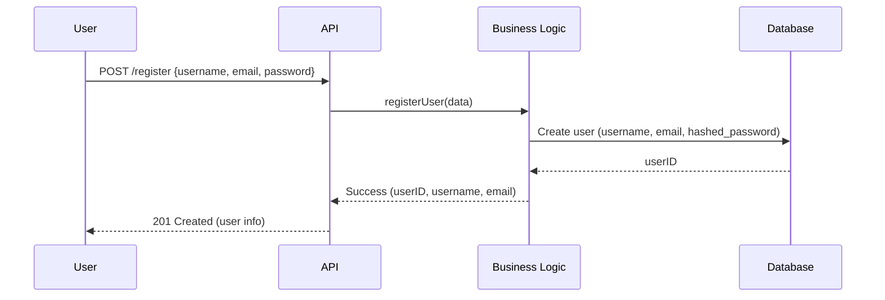
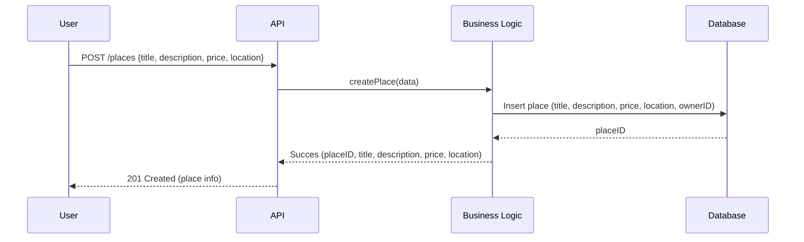
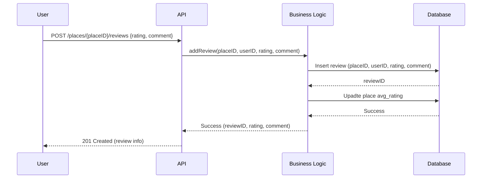
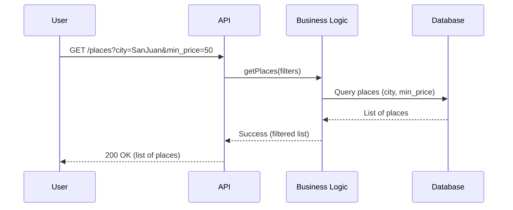

# HBnB Sequence Diagrams

Below are four UML sequence diagrams showing how the HBnB API handles key operations. Each diagram illustrates the interactions between the Presentation, Business Logic, and Persistence layers.

---

## 1. User Registration

**Description:**
This sequence diagram illustrates the process for a new user registration. The user submits their registration details to the API. The API validates and forwards the request to the business logic layer, which manages data validation and user creation. The persistence layer stores the new user and a 'Success' response is returned to the client.

---

## 2. Place Creation

**Description:**
The diagram shows the steps involved when a user creates a new place listing. The API passes the request to the business logic layer for validation and business rule enforcement. Upon succesful validation, the information is saved in the database, and the newly created place details are returned to the user.

---

## 3. Review Submission

**Description:**
This diagram details how a user submits a review for a place. The API receives the review data and passes it to the business logic layer, which enforces business rules. The review is stores in the database, and the average rating for the place is updated. A confirmation response is sent back to the user.

---

## 4. Fetching a List of Places

**Description:**
This diagram depicts how a user retrieves a filtered list of places. The API receives query parameters from the user and relays them to the business logic layer, which applies additional filtering. The persistence layer retireves matching records, and the results are returned to the user through the API.

