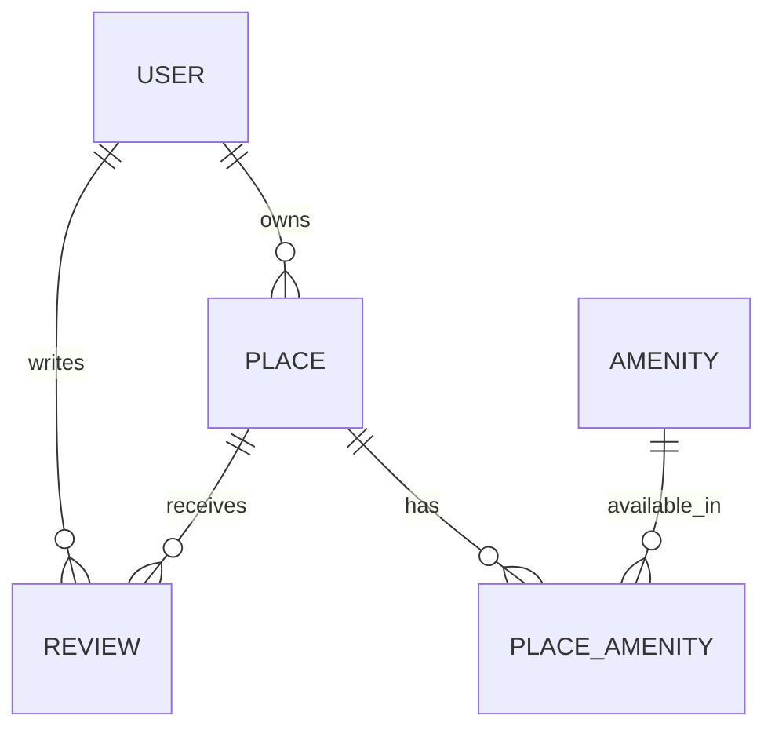

# 🏠 HBnB – Part 3: Database Integration

---

## 📚 Context & Objective

In Part 3, we transition from in-memory storage to a real database backend. You’ll set up SQLite with SQLAlchemy to persist and query your HBnB data. By the end, you will:

* Understand how an ORM maps Python classes to relational tables
* Automate schema creation and handle migrations
* Perform robust CRUD operations via scripts and interactive sessions
* Write and run SQL scripts for custom queries

---

## ⚙️ Prerequisites

* **Python 3.8+**
* **SQLite** (built-in)
* **SQLAlchemy**
* (Optional) **Alembic** for migrations
* A virtual environment (recommended)

```bash
python3 -m venv venv
source venv/bin/activate
pip install -r requirements.txt
```

---

## 🗄️ Database Schema



| Model            | Attributes                                                                                   |
| ---------------- | -------------------------------------------------------------------------------------------- |
| **User**         | `id`, `first_name`, `last_name`, `email`, `password`, `is_admin`, `created_at`, `updated_at` |
| **Place**        | `id`, `title`, `description`, `price`, `latitude`, `longitude`, `owner_id` (FK), timestamps  |
| **Review**       | `id`, `text`, `rating`, `user_id` (FK), `place_id` (FK), timestamps                          |
| **Amenity**      | `id`, `name`, timestamps                                                                     |
| **PlaceAmenity** | `place_id` (FK), `amenity_id` (FK)                                                           |

---

## 🔧 Setup & Schema Creation

1. **Define your models** in `models.py` using SQLAlchemy’s `Base` and `Column` types.
2. **Create the database** and tables:

   ```bash
   python
   >>> from models import Base, engine
   >>> Base.metadata.create_all(engine)
   >>> exit()
   ```
3. (Optional) **Run migrations** with Alembic:

   ```bash
   alembic init migrations
   # edit `alembic/env.py` to point to your engine
   alembic revision --autogenerate -m "Initial schema"
   alembic upgrade head
   ```

---

## 🚀 Usage Examples

* **Interactive shell**:

  ```bash
  python
  >>> from session import Session
  >>> from models import User, Place
  >>> session = Session()
  >>> u = User(first_name="Ana", last_name="Lopez", email="ana@example.com")
  >>> session.add(u); session.commit()
  >>> session.query(User).all()
  ```

* **Import SQL dump** (e.g. TV shows example):

  ```bash
  mysql -u root -p hbtn_0d_tvshows < 15-comedy_only.sql
  ```

* **Custom query scripts**:

  ```bash
  ./list_comedy_shows.py  # prints all Comedy shows
  ./join_shows_genres.py  # prints title — genre
  ```

---

## 🧪 Testing

* **Model tests** (pytest):

  ```bash
  pytest tests/models
  ```
* **SQL script validation**:

  ```bash
  bash tests/run_sql_tests.sh
  ```
* **Integration**:

  ```bash
  pytest tests/integration
  ```

---

## 📂 File Structure

```
part3/
├── models.py
├── session.py
├── import_tvshows.sh
├── list_comedy_shows.py
├── join_shows_genres.py
├── migrations/        # (if using Alembic)
└── tests/
    ├── models/
    ├── integration/
    └── run_sql_tests.sh
```

---

## 🔗 Resources

* [SQLAlchemy ORM Documentation](https://docs.sqlalchemy.org/)
* [SQLite Tutorial](https://www.sqlite.org/docs.html)
* [Alembic Migrations](https://alembic.sqlalchemy.org/)

---

✍️ **Author**
**Josniel Ramos** • Student at Holberton School
GitHub: [@jota009](https://github.com/jota009)
